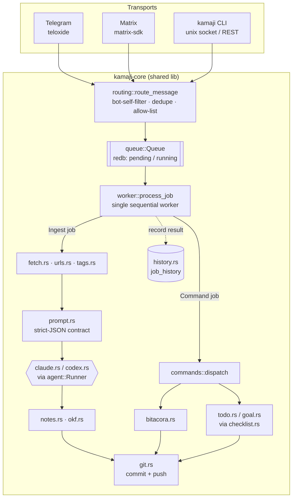

# Kamaji

A Rust daemon that turns incoming messages into markdown notes or dispatched commands. It listens on Telegram, an optional self-hosted Matrix homeserver, and a local/remote CLI, and routes every message down one of two paths:

- **No command (default) → Ingest**: summarize, score, tag, write a markdown note, commit, push.
- **Command (`/something`) → Dispatch**: run a handler, or reply with an error if unrecognized.

Every transport feeds the same routing rule, job queue, and single sequential worker, so behavior is identical no matter where a message came from — see [Message Routing](#message-routing) for the full command surface.

Designed to run unattended on a single Hetzner VM under systemd.

## Stack

- **Transports** (all opt-in; at least one of Telegram/Matrix/REST is required — see [Configure environment](#6-configure-environment)):
  - **Telegram**: `teloxide`, long polling (no webhook).
  - **Matrix**: `matrix-sdk`, against a self-hosted [Tuwunel](docs/matrix.md) homeserver. Runs alongside Telegram, feeding the same queue/worker.
  - **REST API**: optional HTTP listener (TOTP + bearer sessions) for the `kamaji` CLI to reach a remote daemon — see [Remote CLI Usage](#remote-cli-usage).
  - **Unix socket**: always on — the `kamaji` CLI's default, local transport — see [CLI Usage](#cli-usage).
- **Persistence**: `redb` (pure-Rust embedded KV, ACID/WAL) for kamaji's own queue/job-history/dedupe state.
- **Runtime**: tokio.
- **Agent invocation**: pluggable on two independent axes:
  - *Which agent*: `AGENT_FLAVOR=claude` (default) or `codex`, selecting between `claude -p "..." --output-format json` and `codex ... --json`, both parsed into one shared strict-JSON contract (`kamaji-core/src/prompt.rs`).
  - *Where it runs*: `agent::Runner::Direct` (a local `tokio::process::Command` subprocess, the default) or `agent::Runner::OpenShell` (a gRPC `exec` into a pre-provisioned [NVIDIA OpenShell](https://docs.nvidia.com/openshell/latest/about/overview.md) sandbox) — see [OpenShell Runner](#openshell-runner-optional).
- **Notes**: plain markdown, [OKF](https://github.com/GoogleCloudPlatform/knowledge-catalog/tree/main/okf)-conformant YAML frontmatter, git-committed. Obsidian-compatible format. See [Note & Bitacora Frontmatter (OKF)](#note--bitacora-frontmatter-okf).
- **Supervision**: systemd, `Restart=always`.

## Build

```bash
cargo build --release
```

Binaries: `target/release/kamajid` (the daemon) and `target/release/kamaji` (a CLI client that talks to a running `kamajid` over a Unix socket — see [CLI Usage](#cli-usage)).

This is for local iteration. In production, the binaries are built on the VM itself from a clone of this repo — see [Deployment](#deployment).

## Deployment

Run the steps below over SSH on the target VM (e.g. from a Fedora workstation, but nothing here is Fedora-specific — every command is standard across systemd-based Linux distros; package-manager lines are called out separately where they differ).

`kamaji` is created below with `-s /bin/false` (no login shell), so you never `su - kamaji` or start an interactive session as that user anywhere in this guide. Every "as kamaji" action is instead a single one-off `sudo -u kamaji <command>` — clone, `git config`, `cargo build`, etc. — which works even with `/bin/false` as the shell because `sudo` runs the given command directly rather than through the target user's login shell.

### 1. Prepare the VM

Create a dedicated user and directory structure:

```bash
sudo useradd -r -m -s /bin/false kamaji
sudo mkdir -p /opt/kamaji/{bin,data,notes,src}
sudo chown -R kamaji:kamaji /opt/kamaji
```

`-m` creates a home directory for `kamaji` (e.g. `/home/kamaji`). This matters even though the account is a service account: systemd derives `$HOME` for the daemon from this passwd entry, and it's where the git credential files below live. Confirm it landed where expected:

```bash
getent passwd kamaji
```

Install `git`, SQLite's dev headers, and a Rust toolchain as `kamaji` (needed to build on this VM). The SQLite headers are for `rusqlite`, pulled in transitively by `matrix-sdk`'s `sqlite` feature (its own session/crypto store, see CLAUDE.md's Stack section) — without them the build fails at the link step with `error: unable to find library -lsqlite3`, since a minimal Fedora cloud image doesn't have them by default:

```bash
# Fedora:            sudo dnf install -y git sqlite-devel
# Debian/Ubuntu:      sudo apt install -y git libsqlite3-dev
# Arch:               sudo pacman -S git sqlite
sudo -u kamaji sh -c 'curl --proto "=https" --tlsv1.2 -sSf https://sh.rustup.rs | sh -s -- -y'
```

The installer can fail (or simply not run — e.g. a `curl` network hiccup) without making that obvious in the scrollback. Don't assume it worked; confirm the toolchain actually landed before moving on:

```bash
sudo -u kamaji sh -c 'ls -la "$HOME/.cargo/env"'
```

If that reports "No such file or directory", re-run the install command above and watch its output for the actual error this time, rather than proceeding — step 3's `cargo build` will fail with a confusing `.cargo/env: No such file or directory` if this was skipped.

### 2. Set up git credentials

Two separate fine-grained PATs, least privilege:
- `cvicens/kamaji` (code) → **read-only**
- `cvicens/notes` → **read-write**

Read them into env vars in your *own* SSH session (not `kamaji`'s) with `read -s`, so the values are never typed into a command line, never land in argv (visible to other users via `ps`), and never get written to `.bash_history`:

```bash
read -rsp 'GitHub username: ' GH_USERNAME; echo
read -rsp 'Code PAT (read-only, cvicens/kamaji): ' GH_CODE_PAT; echo
read -rsp 'Notes PAT (read-write, cvicens/notes): ' GH_NOTES_PAT; echo
```

Write them into `kamaji`'s credential files, one per repo, so the read-only code token and the read-write notes token can never be mixed up:

```bash
printf 'https://%s:%s@github.com\n' "$GH_USERNAME" "$GH_CODE_PAT" \
  | sudo -u kamaji tee ~kamaji/.git-credentials-src > /dev/null
printf 'https://%s:%s@github.com\n' "$GH_USERNAME" "$GH_NOTES_PAT" \
  | sudo -u kamaji tee ~kamaji/.git-credentials-notes > /dev/null

sudo chmod 600 /home/kamaji/.git-credentials-src /home/kamaji/.git-credentials-notes
sudo chown kamaji:kamaji /home/kamaji/.git-credentials-src /home/kamaji/.git-credentials-notes

unset GH_USERNAME GH_CODE_PAT GH_NOTES_PAT
```

Set the bot's commit identity (unrelated to `$GH_USERNAME` above — see note below):

```bash
cd /opt/kamaji
sudo -u kamaji git config --global user.name "Kamaji Bot"
sudo -u kamaji git config --global user.email "kamaji@example.com"
```

`cd /opt/kamaji` first, deliberately: `sudo -u kamaji` runs the command as `kamaji`, but keeps *your* shell's working directory — it doesn't `cd` into `kamaji`'s home. Even `git config --global` starts by discovering a repo from cwd, so if your own shell happens to be sitting inside a directory `kamaji` can't read (someone else's home dir, a stray `.git` file/symlink left over from earlier experiments, etc.), git fails with `fatal: error reading '.../.git'` before it ever gets to the `--global` write. `/opt/kamaji` is neutral ground — it exists from step 1, is owned by `kamaji`, and isn't any other user's home.

`user.name`/`user.email` are unrelated to `$GH_USERNAME` above — they're the commit-author identity that shows up in `git log`/`blame` for every commit `kamaji` makes, not an authentication credential. They're hardcoded to a fixed bot identity on purpose, so commit authorship stays consistent regardless of whose PAT is loaded at the time. `user.email` isn't optional: without it `git commit` either errors ("Please tell me who you are") or silently falls back to a guessed `kamaji@<hostname>` address — worse than picking one explicitly. It doesn't need to be a real, deliverable inbox.

Deliberately **no global `credential.helper` is set here.** `credential.helper` is a multi-valued git config key: setting it locally in a repo later doesn't replace a global default, it *adds a second entry*, and git tries helpers in file-priority order (global before local), using whichever answers first. Since `git-credential-store` matches by protocol+host only — not by repo path — a global default pointing at the code PAT would silently win for *every* github.com repo, including `notes`, no matter what a local override says. Each repo below pins its own credential file explicitly instead, so there's no host-level ambiguity between the two tokens.

To rotate a PAT later, repeat the `read` + `printf ... | sudo -u kamaji tee ...` pair for that one file — nothing else needs to change.

### 3. Clone the source and build

The clone has to authenticate with the **code** PAT, but a repo-local `credential.helper` can't be set until the repo exists — and it doesn't exist until the clone succeeds. `git -c` breaks that chicken-and-egg problem: it sets a config value for one invocation only, no existing repo required:

```bash
sudo -u kamaji git -c credential.helper="store --file ~/.git-credentials-src" \
  clone https://github.com/cvicens/kamaji /opt/kamaji/src
```

Now that the repo exists, pin the same file as this repo's permanent, repo-local credential source for every future `pull`:

```bash
cd /opt/kamaji/src
sudo -u kamaji git config credential.helper "store --file ~/.git-credentials-src"
sudo -u kamaji sh -c '. "$HOME/.cargo/env" && cargo build --release --workspace'
sudo cp /opt/kamaji/src/target/release/kamajid /opt/kamaji/bin/kamajid
sudo cp /opt/kamaji/src/target/release/kamaji /opt/kamaji/bin/kamaji
sudo chown kamaji:kamaji /opt/kamaji/bin/kamajid /opt/kamaji/bin/kamaji
sudo chmod 755 /opt/kamaji/bin/kamajid /opt/kamaji/bin/kamaji
```

`cargo build --release --workspace` builds both binaries in one pass: `kamajid` (the daemon, deployed as the systemd service below) and `kamaji` (the CLI client).

To ship an update later, run the same four steps via `deploy/update.sh` (it lives in the source clone, so it's already on the VM after step 3):

```bash
sudo bash /opt/kamaji/src/deploy/update.sh
```

Run it as a sudo-capable login user, not as `kamaji` — the script itself drops to `sudo -u kamaji` for the parts that must run as `kamaji` (`git pull`, `cargo build`) and only uses root for installing the binaries and restarting the service. It ends by printing `systemctl status`, so a failed build or a service that doesn't come back up is visible immediately instead of silently leaving the old binaries running.

### 4. Clone the notes repository

The notes repo must exist and be pushable before the bot starts. Same pattern as step 3 — `git -c` for the initial clone, then a repo-local `credential.helper` for everything after:

```bash
sudo -u kamaji git -c credential.helper="store --file ~/.git-credentials-notes" \
  clone https://github.com/cvicens/notes /opt/kamaji/notes
cd /opt/kamaji/notes
sudo -u kamaji git config credential.helper "store --file ~/.git-credentials-notes"
```

Verify the daemon will actually be able to push before starting it:

```bash
cd /opt/kamaji/notes
sudo -u kamaji sh -c 'touch .keep && git add .keep && git commit -m "init" && git push'
```

### 5. Install Claude CLI

This step covers the default agent (`AGENT_FLAVOR=claude`, unset). Running `AGENT_FLAVOR=codex` instead needs the `codex` CLI installed the same way (as `kamaji`, symlinked onto `PATH`) and generally only makes sense paired with the OpenShell runner pointed at a sandbox that has Codex configured — see [OpenShell Runner](#openshell-runner-optional).

The daemon shells out to the `claude` CLI as `kamaji`, so install it **as `kamaji`** rather than under your own login or a separate account — that keeps the CLI's own state (auth/config) under `kamaji`'s home (`/home/kamaji/.claude/`), already covered by this VM's hardening `ReadWritePaths` (see `docs/hardening.md`):

```bash
sudo -u kamaji bash -c 'curl -fsSL https://claude.ai/install.sh | bash'
```

Check the installer's own output for where it actually put the binary — this has changed across versions (currently `~/.local/bin/claude`, i.e. `/home/kamaji/.local/bin/claude`; older versions used `~/.claude/bin/claude`). Don't assume; read the "Location:" line it prints.

Whatever that path is, symlink it into a stable, `PATH`-resolvable spot rather than relying on the installer's suggested shell-rc `PATH` export — `sudo -u kamaji claude ...` and systemd both invoke the binary without sourcing `kamaji`'s `~/.bashrc`, so an rc-file-only `PATH` change is silently ignored in both contexts:

```bash
sudo ln -s /home/kamaji/.local/bin/claude /usr/local/bin/claude
```

`/usr/local/bin` is already on the default `PATH` systemd hands the unit, so `CLAUDE_BIN=claude` (set in step 6) resolves through this symlink with no further config.

Verify: `sudo -u kamaji claude --version`

If the CLI needs an auth step (e.g. `claude auth login` or an API key), run it as `kamaji` too, so credentials land under `/home/kamaji/.claude/` rather than another account's home.

### 6. Configure environment

Copy the systemd unit (from the source clone at `/opt/kamaji/src`, not a relative path — you likely won't be sitting in that directory at this point) and override the environment:

```bash
sudo cp /opt/kamaji/src/deploy/kamaji.service /etc/systemd/system/
sudo mkdir -p /etc/systemd/system/kamaji.service.d
sudo tee /etc/systemd/system/kamaji.service.d/override.conf > /dev/null <<'EOF'
[Service]
Environment="TELEGRAM_BOT_TOKEN=123456:ABC-your-actual-token"
Environment="ALLOWED_CHAT_IDS=123456789,987654321"
Environment="NOTES_REPO_PATH=/opt/kamaji/notes"
Environment="REDB_PATH=/opt/kamaji/data/kamaji.redb"
Environment="CLAUDE_BIN=claude"
Environment="RUST_LOG=kamaji=info,warn"
EOF
```

Use `sudo tee ... <<'EOF'`, not `sudo cat > ... <<EOF` — with the latter, the `>` redirect is opened by *your own* shell before `sudo` ever runs, so only `cat` is elevated, not the file write itself. Against a root-owned directory that can silently produce a mangled or empty file rather than a clean permission error. `tee` runs *as root* under `sudo`, so the write itself is properly elevated; the quoted `<<'EOF'` delimiter also disables shell expansion inside the heredoc, which matters here since a token could contain a `$`.

**Required environment**:
- `NOTES_REPO_PATH`: git repo root; notes are written under `<path>/notes/`.
- `REDB_PATH`: redb database file (created on first run).
- At least one of Telegram, Matrix, or the REST API must be configured (see below) — `kamajid` fails fast at startup otherwise, since a deployment reachable only over the Unix socket is almost certainly a misconfiguration.

**Optional (defaults in `config.rs`)**:
- `TELEGRAM_BOT_TOKEN` (unset by default — Telegram is fully off) — bot token from @BotFather. Once set, `ALLOWED_CHAT_IDS` becomes required.
- `ALLOWED_CHAT_IDS` — required once `TELEGRAM_BOT_TOKEN` is set. Comma-separated Telegram chat IDs. Messages from unlisted chats are silently dropped.
- `MATRIX_HOMESERVER_URL` (unset by default — Matrix is fully off) — base URL of the self-hosted Tuwunel homeserver (see `docs/matrix.md` for standing one up and creating the bot's account/token). Once set, `MATRIX_USER_ID`, `MATRIX_ACCESS_TOKEN`, `MATRIX_DEVICE_ID`, and `ALLOWED_MATRIX_ROOMS` become required.
- `MATRIX_USER_ID` — required once `MATRIX_HOMESERVER_URL` is set. The bot's full Matrix user id (`@kamaji:example.com`).
- `MATRIX_ACCESS_TOKEN` — required once `MATRIX_HOMESERVER_URL` is set. From the one-time manual UIA registration (`docs/matrix.md` step 9) — matrix-sdk's session store persists and refreshes from there, so no password is ever configured.
- `MATRIX_DEVICE_ID` — required once `MATRIX_HOMESERVER_URL` is set. Paired with the access token from the same registration step.
- `MATRIX_STORE_PATH` (default: `kamaji-matrix-store`, relative to the daemon's working directory) — matrix-sdk's own session/crypto store (sqlite-backed, see CLAUDE.md's Stack section).
- `ALLOWED_MATRIX_ROOMS` — required once `MATRIX_HOMESERVER_URL` is set. Comma-separated Matrix room IDs. Events from unlisted rooms are silently dropped, same as `ALLOWED_CHAT_IDS` for Telegram.
- `MATRIX_MEDIA_TIMEOUT_SECS` (default: 30) — timeout for a single Matrix media-content fetch when downloading a `/fact` attachment (Matrix's one-call media API, as opposed to Telegram's `getFile`-then-download).
- `KAMAJI_SOCKET_PATH` (default: `kamaji.sock`, relative to the daemon's working directory) — Unix domain socket the `kamaji` CLI connects to (see [CLI Usage](#cli-usage)).
- `ALIGN_NOISY_TAG_THRESHOLD` (default: 3) — for `/align`'s auto-linking pass: if a TODO's tag overlap would connect it to more than this many not-yet-linked open goals, none of them are auto-linked (treated as a noisy/too-generic tag) and the TODO is surfaced separately for manual `/todo link` instead.
- `DEMONSTRATE_SEMANTIC_MATCH` (default: `true`) — for `/demonstrate`'s auto-linking pass: whether the tag-matched candidate facts for each open goal are additionally filtered by a Claude judgment call before being auto-linked. Set to `false`/`0`/`no` to fall back to pure tag-overlap (no Claude call), the same mechanism `/align` uses.
- `DEMONSTRATE_NOISY_TAG_THRESHOLD` (default: 3) — for `/demonstrate`'s candidate-generation pass: if a fact's tag overlap would connect it to more than this many not-yet-linked open goals, it's treated as noisy/too-generic and skipped entirely this run (mirrors `ALIGN_NOISY_TAG_THRESHOLD`, applied on the fact side instead of the todo side).
- `AGENT_FLAVOR` (default: `claude`) — `claude` or `codex`, selects which agent binary/wire-format is invoked (see [Stack](#stack)). Switching to `codex` only makes sense alongside repointing `OPENSHELL_SANDBOX_NAME` at a sandbox that actually has Codex configured — kamaji doesn't validate that pairing.
- `CLAUDE_BIN` (default: `claude`) — used when `AGENT_FLAVOR=claude` (the default).
- `CODEX_BIN` (default: `codex`) — used when `AGENT_FLAVOR=codex`.
- `AGENT_TIMEOUT_SECS` (default: 120) — timeout for a single agent invocation, regardless of `AGENT_FLAVOR`.
- `GIT_TIMEOUT_SECS` (default: 30)
- `GIT_PUSH_RETRIES` (default: 3)
- `JOB_LEASE_TIMEOUT_SECS` (default: 600) — stale job recovery threshold on restart.
- `WORKER_POLL_INTERVAL_MS` (default: 1000)
- `DEBUG` (default: off) — set to `true`/`1`/`yes` to append a prompt/payload entry per processed job to `DEBUG_LOG_PATH`: for an ingest job, the prompt is the full text sent to the agent (raw message plus any fetched URL content); for a `/command` job, it's the command line. The payload is the reply sent back to the originating chat/room/socket.
- `DEBUG_LOG_PATH` (default: `kamaji-debug.log`) — only written when `DEBUG` is enabled.
- `POLL_WATCHDOG_TIMEOUT_SECS` (default: 60) — if the Telegram long-poll connection produces neither an update nor an error within this window (e.g. a connection left half-open across a network drop or a laptop sleep/wake), the listener is torn down and rebuilt rather than left hanging indefinitely.
- `MAX_FETCHED_TEXT_BYTES` (default: 300000) — cap on the combined size of fetched URL content for one ingest job. Links found in a message are fetched (level 0), and links found *inside* that fetched content are followed one level deeper (level 1, capped at 5 URLs) and no further. If the combined fetched content still exceeds this limit, ingestion is skipped (not sent to the agent) and the user is told why.
- `TELEGRAM_FILE_TIMEOUT_SECS` (default: 30) — timeout for a single Telegram file API call (`getFile` or the download itself) when fetching a `/fact` attachment.
- `MAX_ATTACHMENT_BYTES` (default: 20000000) — defensive cap on `/fact` attachment size, independent of Telegram's own ~20MB bot-download limit.
- `REST_API_BIND` (unset by default — the REST API is fully off) — `host:port` to bind the optional REST API listener to, e.g. `127.0.0.1:8081`. Setting this is only the first step of enabling remote CLI access; see [Remote CLI Usage](#remote-cli-usage) and `docs/remote-api.md` for the full setup (TOTP enrollment, reverse proxy, etc.) before setting it in production.
- `REST_API_TOTP_SECRET` — required once `REST_API_BIND` is set. Base32 TOTP secret, generated via `kamajid --print-totp-setup`.
- `REST_API_SESSION_TTL_SECS` (default: 604800, i.e. 7 days) — how long a bearer session token from `/auth/login` stays valid. Kept short by default since there's no way to identify and revoke a single leaked token from the daemon side other than `kamaji logout` (which needs the token itself) or `kamajid --revoke-all-sessions` (which kills every session at once) — see [Remote CLI Usage](#remote-cli-usage).
- `OPENSHELL_GATEWAY_URL` (unset by default — the OpenShell runner is fully off, `kamajid` invokes the agent binary as a local subprocess exactly as before) — gRPC URL of the OpenShell gateway. Once set, `OPENSHELL_SANDBOX_NAME` becomes required. See [OpenShell Runner](#openshell-runner-optional) below before setting this.
- `OPENSHELL_SANDBOX_NAME` — required once `OPENSHELL_GATEWAY_URL` is set. Name of the **already-running, pre-provisioned** sandbox to `exec` into; `kamajid` never creates, provisions, or deletes it.
- `OPENSHELL_READY_TIMEOUT_SECS` (default: 30) — bounds only the one-time startup `wait_ready` check, not each `exec` call (that's still `AGENT_TIMEOUT_SECS`).
- `OPENSHELL_MTLS_DIR` (unset by default — anonymous TLS/plaintext to the gateway) — directory containing `ca.crt`/`tls.crt`/`tls.key` (same filenames `openshell-cli` uses) for a gateway with `--enable-mtls-auth` on, this gateway's actual default posture for local single-user gateways. kamaji never mints this identity — it's a copy of the gateway's existing local client cert, provisioned out-of-band (see `docs/openshell.md`).

### OpenShell Runner (optional)

By default, `kamajid` invokes `claude` via `tokio::process::Command` as a local subprocess (`agent::Runner::Direct`). Setting `OPENSHELL_GATEWAY_URL` switches to `agent::Runner::OpenShell` (`kamaji-core/src/agent.rs`), which `exec`s the same `claude` binary inside a pre-provisioned [NVIDIA OpenShell](https://docs.nvidia.com/openshell/latest/about/overview.md) sandbox over gRPC instead. The *agent* invoked never changes — it's always `claude` (`CLAUDE_BIN`), regardless of which runner launches it — only *where* it runs changes.

`kamajid` only ever `exec`s into the sandbox plus one startup `wait_ready` check; it never creates, provisions, or deletes the sandbox. All provisioning (installing/running the gateway, creating the sandbox, attaching providers, writing network policy) is out-of-band `openshell` CLI work, done once before `kamajid` ever touches `OPENSHELL_GATEWAY_URL`.

**1. Install and run the OpenShell gateway itself.** Neither doc in this repo covers this step — `docs/openshell.md`'s own "Prerequisites" section assumes "Working OpenShell installation and gateway" as a given, and `docs/openshell-gw-proxy.md` explains the gateway's *role* (see its [§4, "Gateway vs. proxy"](docs/openshell-gw-proxy.md#4-gateway-vs-proxy-two-different-components-two-different-jobs)) rather than how to stand one up. For that, go to NVIDIA's own docs — [docs.nvidia.com/openshell](https://docs.nvidia.com/openshell/latest/home), specifically "Manage Gateways" and "How OpenShell Works" (the two pages `docs/openshell-gw-proxy.md` itself cites as sources). Once a gateway is reachable, enable Providers v2 (`docs/openshell.md`'s [Prerequisites](docs/openshell.md#prerequisites)):
   ```bash
   openshell settings set --global --key providers_v2_enabled --value true
   ```

**2. Provision a sandbox.** `docs/openshell.md`'s [Full rebuild](docs/openshell.md#full-rebuild) section is a worked, copy-pasteable example — it writes a custom provider profile (network policy: which hosts, which binaries), creates the inference-routing and policy-carrying providers, then `openshell sandbox create --name <name> --provider <policy-provider> ...`. Read [§1, "The two routes at a glance"](docs/openshell-gw-proxy.md) in `docs/openshell-gw-proxy.md` first if the difference between `inference.local` routing and a direct external-endpoint policy isn't obvious — the rebuild steps use both, for different reasons (see the doc's "Why this isn't trivial" section, points 2–3). [Verification](docs/openshell.md#verification) and a [troubleshooting table](docs/openshell.md#troubleshooting-quick-reference) follow the rebuild steps in the same doc; [Full teardown](docs/openshell.md#full-teardown) is the reverse.

**3. Point kamaji at it.** Only once a sandbox is confirmed working (step 2's verification) does the `OPENSHELL_*` env config above become meaningful.

`OPENSHELL_SANDBOX_NAME` is just the `--name` you gave `openshell sandbox create` in step 2 (`openshell sandbox list` shows every sandbox on the gateway with its `Phase`, if you forget). `OPENSHELL_GATEWAY_URL` is **not** something you invent — it's the endpoint of the gateway you set up in step 1, and where to find it depends on whether you're running `kamajid` on the same host as the gateway (the assumed single-VM setup — see CLAUDE.md's Stack section) or against a remote one:

```bash
openshell status          # shows the currently-selected gateway's Server: URL and auth mode
openshell gateway list    # shows every configured gateway (NAME / ENDPOINT / TYPE / SOURCE / AUTH)
```

Use the `ENDPOINT` column value verbatim as `OPENSHELL_GATEWAY_URL` (e.g. `https://127.0.0.1:17670` for a local gateway). **Check the `AUTH` column before wiring it in.** `OpenShellConfig`'s v1 auth surface (`kamaji-core/src/config.rs`) is deliberately anonymous/plaintext-only — `Runner::connect` (`kamaji-core/src/agent.rs`) builds its client with `ClientConfig::new(gateway_url)` and nothing else, no certs, no token. That's fine against a gateway whose `AUTH` is `none`/plaintext, but a gateway provisioned with `mtls` or any other authenticated mode (a real possibility even for a "local" gateway — `openshell gateway list`'s `AUTH` column reports this per gateway, not assumed from the URL) will reject that bare connection; `wait_ready` fails at `kamajid` startup, not silently later. `AuthConfig::EdgeJwt`/`Oidc` are explicit future scope in `OpenShellConfig` (see `TODO.md`) — mTLS support isn't there either yet, so an `mtls`-auth gateway needs that added to `kamaji-core` before `OPENSHELL_GATEWAY_URL` can point at it.

Before pointing `OPENSHELL_SANDBOX_NAME` at any sandbox, confirm its policy allows the `claude` binary and reaches wherever it needs to talk (by default, `api.anthropic.com`) — the gateway denies anything not explicitly allowed, and a denial surfaces as a runtime `exec` failure, not a config-time error.

**`codex-deepseek-v2` specifically is not a drop-in target.** `docs/openshell.md`'s "Full rebuild" section provisions that sandbox for the **Codex** CLI routed to DeepSeek — its policy allows only the binaries `/usr/bin/codex`, `/usr/local/bin/codex`, `/usr/local/bin/hermes`, and the endpoints `api.deepseek.com` / `inference.local`. It does not allow `claude`, and does not allow `api.anthropic.com`. Since kamaji's runner always execs `claude`, setting `OPENSHELL_SANDBOX_NAME=codex-deepseek-v2` as-is will fail at exec time — this is a real policy mismatch, not a typo to fix.

To actually route kamaji's Claude calls through DeepSeek in a sandbox like this one, use `docs/openshell.md`'s [Variant: Claude Code on DeepSeek](docs/openshell.md#variant-claude-code-on-deepseek) section instead of the Codex rebuild steps. That variant:
- Adds a custom policy/provider granting the `claude` binary access to `api.deepseek.com` (DeepSeek's Anthropic-compatible endpoint at `/anthropic`), instead of Codex's DeepSeek/`inference.local` policy.
- Launches with `env ANTHROPIC_BASE_URL=https://api.deepseek.com/anthropic claude ...` so Claude Code talks to DeepSeek directly (model names auto-map: `claude-opus*` → `deepseek-v4-pro`, `claude-sonnet*`/`claude-haiku*` → `deepseek-v4-flash`).

Two gaps to close before that variant works end-to-end with `kamajid` as-is, both in `kamaji-core/src/agent.rs`, not just env config:
- `invoke_openshell`'s `ExecOptions` currently hardcodes `environment: HashMap::new()` — no env vars are forwarded into the sandbox at all, so there is no existing `OPENSHELL_*` knob to set `ANTHROPIC_BASE_URL` inside the exec call. Routing Claude to DeepSeek via this runner needs that forwarding added first.
- Decide whether the DeepSeek-routing endpoint/provider lives in the *same* sandbox as `codex-deepseek-v2` (attach a second policy-carrying provider covering `claude` + `api.deepseek.com`) or a separate sandbox (e.g. the `claude-deepseek` name the docs use), then point `OPENSHELL_SANDBOX_NAME` at whichever one you provision.

### 7. Start the service

```bash
sudo systemctl daemon-reload
sudo systemctl enable kamaji
sudo systemctl start kamaji
sudo systemctl status kamaji
```

Logs: `journalctl -u kamaji -f`

### 8. (optional) Scheduled `/align` auto-linking

`deploy/kamaji-align.service` + `deploy/kamaji-align.timer` run `kamaji align` on an hourly systemd timer instead of only on demand — a Unix-socket call, not REST, since REST's TOTP/session login is built for an interactive human, not an unattended timer. `/align` auto-links open TODOs to open goals they share a tag with (writing to the notes repo and committing), then reports the result — not just a read-only report, so `align` is a `CommandMode::Queued` command like `/todo`/`/goal`, and a run can be briefly delayed behind an in-flight job (an acceptable trade-off of writing to git, same as any other queued command). A TODO whose tag overlap would connect it to more than `ALIGN_NOISY_TAG_THRESHOLD` goals is treated as noisy and left unlinked — surfaced in its own report section for manual `/todo link <ref> <goal key>` instead. Output goes to the journal only for v1; there's no push to Telegram/Matrix yet (that waits on a not-yet-built notify relay, see `TODO.md`).

```bash
sudo cp /opt/kamaji/src/deploy/kamaji-align.service /opt/kamaji/src/deploy/kamaji-align.timer /etc/systemd/system/
sudo systemctl daemon-reload
sudo systemctl enable --now kamaji-align.timer
```

Adjust the cadence by overriding `OnCalendar=` in `deploy/kamaji-align.timer` before copying it (e.g. `*:0/15` for every 15 minutes) — hourly is just a starting point. Logs: `journalctl -u kamaji-align.service`. If `KAMAJI_SOCKET_PATH` is overridden away from the default in `kamaji.service`'s override, uncomment and match the same value in `kamaji-align.service`.

### 9. (optional) Scheduled `/demonstrate` auto-linking

`deploy/kamaji-demonstrate.service` + `deploy/kamaji-demonstrate.timer` mirror step 8 exactly, but run `kamaji demonstrate` instead: it auto-links bitacora facts to open goals they demonstrate progress on (writing to the notes repo and committing), then reports the result. Unlike `/align`, facts never close/expire, so a run defaults to scanning only the *current quarter* rather than the whole bitacora — pass `all` or an explicit `YYYY-Q1..4` to widen or shift the scope (`kamaji demonstrate all`). Matching is two-stage: cheap tag overlap narrows candidates per fact (a fact matching more than `DEMONSTRATE_NOISY_TAG_THRESHOLD` not-yet-linked goals is treated as noisy and skipped entirely, surfaced in its own report section), then — by default (`DEMONSTRATE_SEMANTIC_MATCH=true`) — a Claude call per goal with candidates judges which of them actually demonstrate it, rather than just sharing a tag; set `DEMONSTRATE_SEMANTIC_MATCH=false` to fall back to pure tag-overlap like `/align`. `demonstrate` is `CommandMode::Queued`, same as `align`. Output goes to the journal only for v1; there's no push to Telegram/Matrix yet (same not-yet-built notify relay as step 8).

```bash
sudo cp /opt/kamaji/src/deploy/kamaji-demonstrate.service /opt/kamaji/src/deploy/kamaji-demonstrate.timer /etc/systemd/system/
sudo systemctl daemon-reload
sudo systemctl enable --now kamaji-demonstrate.timer
```

Adjust the cadence the same way as step 8. Logs: `journalctl -u kamaji-demonstrate.service`. Same `KAMAJI_SOCKET_PATH` note as step 8 applies.

## Architecture

How the pieces fit together — transports feed one routing rule, one queue, and one worker in `kamaji-core`; ingest and command jobs fan out from there. See [Message Routing](#message-routing) and [Job Processing Pipeline](#job-processing-pipeline) below for the prose version of this same flow.



## Message Routing

This rule is defined exactly once (`routing::route_message`) and applies identically regardless of which transport the message came from — Telegram, Matrix, or the `kamaji` CLI.

- **No leading `/`** → enqueued as an `Ingest` job: the agent summarizes + scores + tags, writes a markdown note under `notes/<date>-<slug>.md`, commits, pushes.
- **Leading `/`** → parsed as a command. If the command is unknown, an error is replied immediately and no job is enqueued — it never falls through to ingest. Otherwise, dispatch depends on the command's registered `CommandMode` (`commands.rs`):
  - `Sync` — runs immediately on the originating update's own task, bypassing the ingest queue entirely, and is not recorded in job history. Used for fast, read-only commands with no agent/git involvement, so they never wait behind an in-flight ingest job. `/help`, `/status`, `/history` are `Sync`.
  - `Queued` — enqueued and processed by the single sequential worker like an ingest job, and recorded in job history. Used by any command that invokes the agent or touches the notes git repo, to preserve the "no concurrent agent runs against the same working directory" guardrail. `/ingest`, `/fact`, `/todo`, `/goal` are `Queued`.

### `/ingest <link or text>`

- A link takes the same path as the no-command default: fetch, summarize, score, tag, write a note, commit, push.
- Freeform text is **not** filed as a note — it's passed straight to the agent, which replies directly in the originating chat/room.
- No argument is a usage error: replied to immediately, without enqueueing a job (same as an unknown command).

### `/fact <description>` (bitacora / bio-log)

Logs a personal accomplishment/activity entry, separate from the note-taking `notes/` pipeline. Unlike `/ingest`, there's no agent-passthrough branch — every `/fact` call writes an entry, whether or not it contains a link.

- A file can be attached to the same message: send the document with the caption `/fact <description>` (Telegram puts the caption on the message alongside the document, and Matrix has an equivalent; the bot reads it the same way it reads plain command text). Neither a description nor an attachment is a usage error, replied to immediately without enqueueing a job.
- The file is downloaded and saved next to the note, but **its contents are not yet extracted or shown to the agent** — only its filename is. Content extraction (parsing md/txt/html, and PDF via a to-be-added crate) is a planned follow-up (see `TODO.md`).
- Any URLs in the description are fetched the same way `/ingest` fetches links.
- Entries are written under `notes/bitacora/<YYYY>/<Month>/<timestamp>-<slug>.{md,orig}` (plus `-<filename>` for an attachment): the `.md` is the rendered note with YAML frontmatter, the `.orig` is the raw message text saved verbatim so nothing the agent summarized away is lost.

### `/todo` and `/goal` (id-tagged checklists)

Two independent, dated markdown checklists sharing one engine (`checklist.rs`) — only the folder, filename suffix, and close-subcommand name differ. Neither involves the agent at all beyond a fast local write; both are `Queued` only because they touch the notes git repo (commit + push), same guardrail as `/ingest`/`/fact`.

- `/todo add <text> #tag1 #tag2` / `/goal add <text> #tag1 #tag2` — appends a new open entry (auto-incrementing id, `#`-prefixed freeform tags) to `<notes_repo>/todo/<YYYY>/<MM>-todo.md` or `<notes_repo>/goals/<YYYY>/<MM>-goals.md`, commits, pushes.
- `/todo list [open|close]` / `/goal list [open|close]` — lists entries, defaulting to open only.
- `/todo resolve <id>` — closes a todo. `/goal achieve <id>` — closes a goal (its own verb, since "resolved" reads oddly for a longer-lived goal).
- A malformed subcommand is a usage error: replied to immediately, without enqueueing a job.
- **CLI note:** `/todo` is reachable from the `kamaji` CLI (`kamaji todo ...`, see [CLI Usage](#cli-usage)); `/goal` currently is not — it's only wired up on the Telegram/Matrix transports.

## Job Processing Pipeline

What happens once a message has been routed (see [Message Routing](#message-routing) above) and turned into a job — independent of whether it arrived via Telegram, Matrix, or the `kamaji` CLI:

1. **Dequeue.** A single sequential worker pulls the oldest unleased job from the queue (FIFO), leases it, and hands it to `process_job`. The payload isn't removed until the job fully completes, so a crash mid-processing loses nothing — the stale lease is recovered on restart and the job is retried from scratch.
2. **Ingest jobs** (no-command default, and the link branch of `/ingest`):
   - `#tags` are extracted from the user's raw text only, before any URL is fetched — a linked article's own hashtags/anchors never leak into the note's tags.
   - A message that's only links/tags with nothing else, or whose links all fail to fetch with nothing else to summarize, skips the agent call entirely and replies with why, rather than spending tokens on an empty note.
   - URLs in the message are fetched (level 0), then links found *inside* that fetched content are followed one hop further (level 1, capped at 5 URLs) — never deeper. Auth-walled sources (X/Twitter, Instagram, etc.) get a placeholder explaining why instead of failing outright.
   - If combined fetched content exceeds `MAX_FETCHED_TEXT_BYTES`, ingestion is skipped and the user is told.
   - Otherwise the agent is called with the raw text, fetched content, and existing note categories. Its strict-JSON reply (see [Ingest Path Contract](#ingest-path-contract)) is parsed; on failure, the raw output is logged, no note is written, and the user is told ingestion failed.
   - The user's inline tags are merged with the agent's inferred ones, the OKF-frontmattered note is written to disk, then committed and pushed (see [git push retry behavior](#ingest-path-contract)).
3. **Command jobs** dispatch by name. `/ingest`, `/fact`, `/todo`, `/goal` are special-cased because they touch the notes git repo (and, for `/ingest`/`/fact`, the agent, with token accounting) and need real success/failure tracking; every other `Queued` command goes through the same generic dispatcher (`commands::dispatch`).
4. **Reply and record.** The reply text is delivered back to whichever chat/room/socket the job came from, a `job_history` record (success/failure, token usage, job kind) is written, and the job is marked complete — removed from the pending queue. Any error along the way (agent failure, git failure, malformed payload) is captured in that history record rather than propagated: one bad job is logged and skipped, never taking the daemon down, and the worker loops back to the next one.

## Ingest Path Contract

The agent's ingest prompt returns strict JSON only, regardless of `AGENT_FLAVOR`:
```json
{
  "title": "string",
  "summary": "2-4 sentences",
  "importance": 1,
  "tags": ["freeform", "tags"],
  "source_url": "string or null",
  "slug": "url-safe-filename-fragment"
}
```

`importance` is an integer from 1 (trivial) to 5 (critical). `tags` are freeform, no fixed taxonomy.

On parse failure: logs the raw output, does not write a note, tells the user (on whichever transport the message came from) that ingestion failed.

`git push` is fallible: bounded retry with backoff. If it still fails, the note stays committed locally and the user is told it didn't push.

## Fact / Bitacora Path Contract

The agent's `/fact` prompt returns strict JSON only, a different shape from the ingest contract above — no `category`/`source_url`, and `importance` is named `value` to match the bio-log framing:
```json
{
  "title": "string",
  "summary": "2-4 sentences describing what was done and why it mattered",
  "value": 1,
  "tags": ["freeform", "tags"],
  "slug": "url-safe-filename-fragment"
}
```

`value` is an integer from 1 (minor/routine) to 5 (major accomplishment), intended to make a future quarterly self-review easy to filter ("show me everything scored 4-5"). `tags` are freeform, no fixed taxonomy.

An attachment download failure degrades gracefully: the fact is still filed (text + any fetched links), and the reply says the attachment couldn't be saved rather than failing the whole entry. An agent/parse failure behaves like the ingest contract: logs the raw output, writes nothing, tells the user.

## Note & Bitacora Frontmatter (OKF)

Notes and bitacora entries carry [OKF (Open Knowledge Format)](https://github.com/GoogleCloudPlatform/knowledge-catalog/tree/main/okf)-conformant YAML frontmatter, so the git-committed notes repo doubles as a knowledge bundle downstream agents can consume. OKF requires exactly one field — a non-empty `type` — and *recommends* `title`, `description`, `resource`, `tags`, `timestamp`; every other key is a producer-defined custom field that conformant consumers must preserve. kamaji's domain-specific fields ride along as those custom fields, fully in spec. The rendering lives in `kamaji-core/src/okf.rs` (shared helpers) plus `notes.rs` / `bitacora.rs`; the strict-JSON contract above is **unchanged** — `description` is derived in Rust as the first sentence of `summary`. Applied to newly written entries only; files already committed are left as-is.

Ingest note (`notes/<category>/<date>-<slug>.md`):
```yaml
---
type: note
title: "..."
description: "First sentence of the summary."   # derived, not a Claude field
resource: "https://example.com"                 # OKF: canonical URI (was source_url); omitted when absent
tags: ["freeform", "tags"]
timestamp: 2026-07-09T00:00:00Z                 # ISO 8601; notes anchor at midnight UTC
category: "programming"                          # custom: topic folder
importance: 4                                    # custom: 1-5
---
```

Bitacora entry (`bitacora/<YYYY>/<Month>/<timestamp>-<slug>.md`):
```yaml
---
type: fact
title: "..."
description: "First sentence of the summary."
tags: ["freeform", "tags"]
timestamp: 2026-07-14T15:30:45Z                 # ISO 8601, full clock time
value: 4                                         # custom: 1-5
attachment: "<base>/<filename>"                  # custom: present only when a file was attached
---
```

`type` is the *kind* of knowledge (`note` vs. `fact`), orthogonal to a note's `category` (its topic). A fact has no `resource` — its attachment is a repo-local file, not a canonical external URI.

## Critical Guardrail

The default (no-command) path triggers ingestion, so **the bot-self-filter is the primary loop guardrail, on every transport** — not a secondary check. Telegram compares `from.id == bot_id` (`kamajid/src/transport/telegram.rs`); Matrix compares the event's `sender` against the bot's own Matrix user id (`is_matrix_self`, `kamajid/src/transport/matrix.rs`). If the bot's own reply ever lands back in the trigger chat/room unfiltered, it has no command prefix, gets re-ingested as a new note, replies again → infinite loop, infinite commits. Filter the bot's own messages before any other routing logic, on both platforms. The tests for this (`telegram::tests::bot_self_filter_test`, `matrix::tests::matrix_bot_self_filter_drops_own_messages`) must stay green.

## Manual Test Plan

Before production:

1. **Restart recovery**: enqueue a job (send a non-command message), kill the daemon mid-processing (before `complete`), restart. The job must be recovered and processed once.
2. **Dedupe on replay**: send a message, let it process, restart the bot. The Telegram long-polling replay must not re-enqueue the same message (check logs for "dedupe: already processed").
3. **Bot ignores its own messages**: send a message that triggers a note. The bot's confirmation reply ("Note written: ...") must not itself trigger another ingest job (watch logs for a second enqueue with the confirmation text as raw_text).
4. **No-URL message**: send plain text with no URLs; must still produce a sensible note.
5. **Unknown command**: send `/bogus`. Bot must reply with an error listing available commands, and must not enqueue a job.
6. **Git push failure**: temporarily break git push (remove the remote or revoke SSH key access), send a message. Note must be written and committed locally, and the reply must say "committed locally, but git push failed after retries" (not silent failure).
7. **Sync command doesn't wait on an in-flight ingest**: send a message that triggers ingestion (agent call + git push, several seconds), then immediately send `/status`. The `/status` reply must come back right away, not after the ingest job finishes.

This plan exercises the Telegram transport concretely, but every check applies identically to Matrix (`docs/matrix.md`) since both feed the same routing rule, queue, and worker.

## CLI Usage

`kamaji` is a thin client for a running `kamajid` daemon — it connects over the Unix socket at `KAMAJI_SOCKET_PATH` (default `kamaji.sock`), sends one request, prints the reply, and exits. It does not process jobs itself: write-commands are enqueued into the same queue `kamajid`'s single worker already drains, so the "no concurrent agent/git runs" guardrail holds unchanged whether the request came from Telegram, Matrix, or the shell.

```bash
kamaji status
kamaji history [limit]
kamaji ingest <link or text>
kamaji fact <description>
kamaji todo add <text> #tag1 #tag2
kamaji todo list [open|close]
kamaji todo resolve <id>
kamaji align
kamaji demonstrate [all|YYYY-Q1..4]
kamaji help
```

`--socket <path>` overrides `KAMAJI_SOCKET_PATH` for a single call, e.g. `kamaji --socket /opt/kamaji/data/kamaji.sock status` when running from outside `kamajid`'s working directory.

If `kamajid` isn't running (or the socket path is wrong), `kamaji` prints a clear "kamajid is not running at `<path>`" error and exits non-zero — it never falls back to processing the request standalone. `ingest`/`fact`/`todo` block until the worker finishes the job (bounded by the same Claude/git timeouts `kamajid` uses internally, plus a margin) and print the same confirmation text Telegram/Matrix would get.

### Transport resolution order

`kamaji` picks between the local Unix socket and a remote REST API (`--remote`, see below) once per call, in this order:

1. `--local` — forces the local socket, ignoring `--remote` and `KAMAJI_REMOTE_URL` entirely. The escape hatch for "run this one command locally" without unsetting an exported env var.
2. `--remote <url>` typed explicitly — beats `--socket`, typed or not.
3. `--socket <path>` typed explicitly — beats `KAMAJI_REMOTE_URL`. An explicitly typed flag is a stronger signal of intent than inherited environment, so the env var is only consulted when `--socket` was **not** given on the command line.
4. `KAMAJI_REMOTE_URL` — used only if none of the above applied.
5. `KAMAJI_SOCKET_PATH`, then the built-in default socket path — the fallback when nothing above resolved to a remote.

`KAMAJI_REMOTE_URL` and `KAMAJI_SOCKET_PATH` are trimmed, and an empty or whitespace-only value is treated as unset (so `KAMAJI_REMOTE_URL=` correctly undoes an earlier `export`, rather than becoming a URL that is the empty string). `--remote`/`KAMAJI_REMOTE_URL` must be an `http(s)` URL — a bare host or other scheme is rejected with an error naming which of the two supplied it; plain `http` is accepted with a warning (the bearer token would cross a real network in cleartext, but loopback testing against `http://127.0.0.1` is legitimate).

### Remote CLI Usage

The same commands work from a second machine over the internet, instead of only from the VM itself — the REST API is opt-in (`REST_API_BIND` unset means it's completely off, see above) and requires a one-time TOTP enrollment plus a reverse proxy for TLS. Full setup (DNS, `kamajid --print-totp-setup`, the Caddy config) is in `docs/remote-api.md`; once that's done:

```bash
kamaji --remote https://kamaji.example.com login   # prompts for a TOTP code, caches a session token
kamaji --remote https://kamaji.example.com status
kamaji --remote https://kamaji.example.com ingest <link or text>
```

`--remote` (or `KAMAJI_REMOTE_URL`) replaces the Unix socket with an HTTPS call to `kamajid`'s REST API, authenticated with the bearer token `login` cached at `~/.kamaji/token` (mode `0600`). Every other subcommand above works identically over either transport — the same `CliRequest`/`CliResponse` types are used regardless of `--socket` or `--remote`. See [Transport resolution order](#transport-resolution-order) above for exactly how `--remote`/`--socket`/`--local` and their env fallbacks interact.

**Logging out** (lost/stolen device, or just done with remote access from that machine):

```bash
kamaji --remote https://kamaji.example.com logout
```

Clears the local token cache and asks `kamajid` to invalidate that session too. Clears the local cache even if the daemon can't be reached (offline, token already expired, etc.) — "log me out" always succeeds locally; the remote revoke is best-effort on top.

If the device with the cached token is gone and you can't run `logout` from it, kill every outstanding session at once from the VM instead:

```bash
kamajid --revoke-all-sessions
```

This only needs `REDB_PATH` (same default as everything else) — it doesn't require the daemon to be running or any of its other env vars set, since it's a one-off admin operation against the same database file.

## License

MIT OR Apache-2.0
